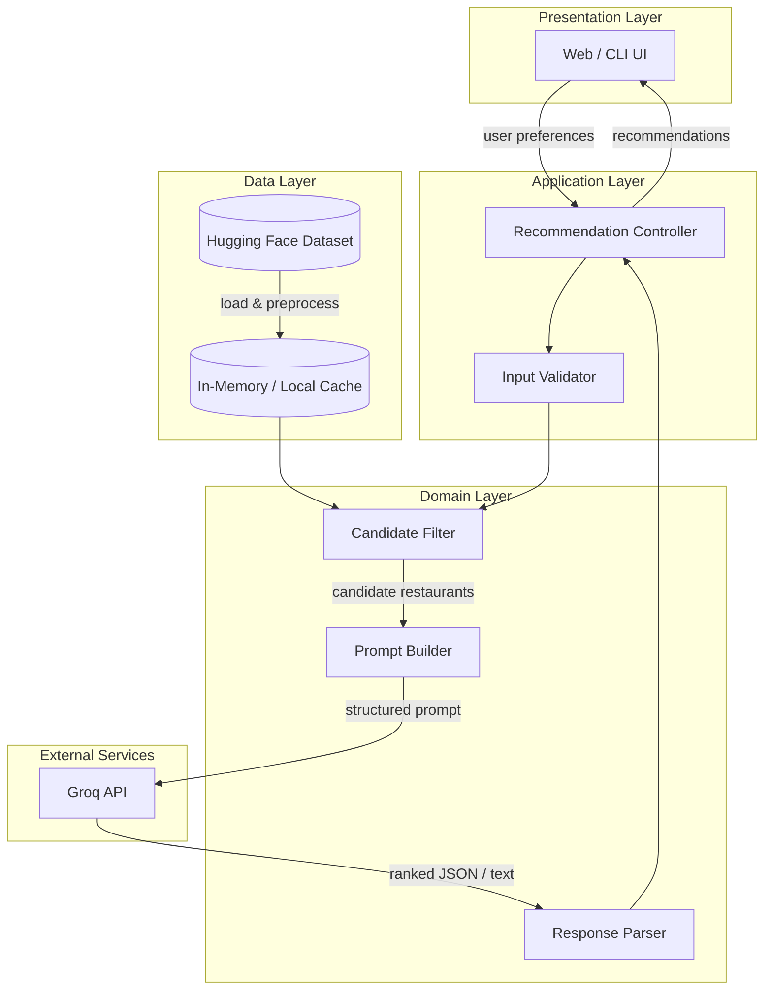
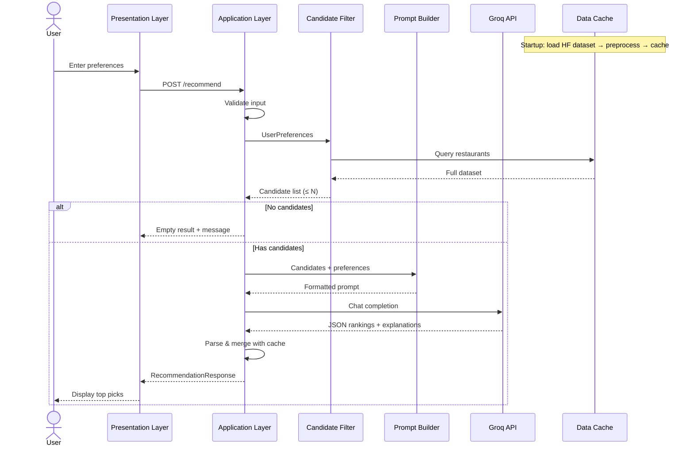
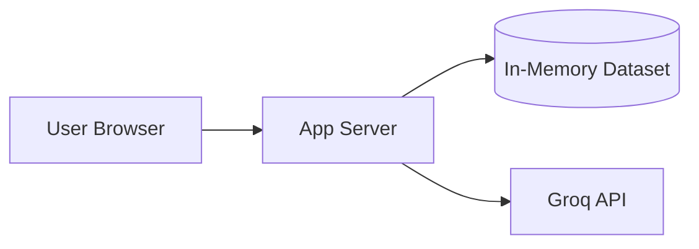

# Architecture: AI-Powered Restaurant Recommendation System

> Derived from [context.md](context.md) and [Docs/problemStatement.txt](Docs/problemStatement.txt)  
> Use case inspired by **Zomato**

## 1. Purpose

This document defines the **system architecture** for an AI-powered restaurant recommendation service. The application combines **structured restaurant data** from Hugging Face with **Groq** (LLM) to produce ranked, explainable recommendations tailored to user preferences.

### Goals

| Goal | Description |
|------|-------------|
| **Personalization** | Match recommendations to location, budget, cuisine, rating, and free-text preferences |
| **Grounding** | Recommendations must be derived from real dataset rows, not invented restaurants |
| **Explainability** | Each result includes an AI-generated reason tied to user input |
| **Usability** | Results are presented in a clear, scannable format |

### Non-Goals (per problem scope)

- User authentication and persistent profiles
- Real-time restaurant availability or booking
- Payment or order placement
- Multi-tenant SaaS or production-scale infra (unless added later)

---

## 2. High-Level Architecture

The system follows a **layered pipeline architecture**: ingest data once, accept user input at request time, filter candidates deterministically, then delegate ranking and explanation to **Groq**.



### Architectural Style

| Aspect | Choice | Rationale |
|--------|--------|-----------|
| Pattern | **Layered + pipeline** | Clear separation: data → filter → LLM → display |
| Coupling | **Loose via interfaces** | Groq client is abstracted for testing; UI remains swappable |
| State | **Mostly stateless per request** | Simplifies scaling; dataset cached at startup |
| Intelligence split | **Rules filter + LLM rank** | Reduces hallucination risk; LLM focuses on reasoning |

---

## 3. Component Design

### 3.1 Presentation Layer (Output Display)

**Responsibility:** Collect user preferences and render top recommendations.

| Concern | Design |
|---------|--------|
| Input form | Fields for location, budget, cuisine, min rating, additional notes |
| Output cards | Name, cuisine, rating, estimated cost, AI explanation |
| Optional summary | Short LLM overview of the recommendation set |
| Error UX | Validation messages, empty-result guidance, LLM failure fallback |

**Recommended options (not mandated):**

- **Streamlit** — fastest path for a demo UI
- **React + REST API** — better for a production-style frontend
- **CLI** — useful for testing the pipeline without UI overhead

### 3.2 Application Layer (Orchestration)

**Responsibility:** Coordinate the end-to-end recommendation flow.

```
POST /recommend
  Request  → UserPreferences
  Response → RecommendationResponse
```

**Flow:**

1. Validate and normalize input
2. Invoke candidate filter
3. Build Groq prompt from filtered candidates
4. Call Groq and parse structured output
5. Merge Groq rankings with source restaurant records
6. Return formatted response

**Error handling:**

| Failure | Behavior |
|---------|----------|
| Invalid input | `400` with field-level errors |
| No candidates after filter | `200` with empty list + suggestion to relax filters |
| Groq timeout / error | Retry once; fallback to rule-based top-N by rating |
| Malformed Groq JSON | Re-prompt with stricter format or use parser recovery |

### 3.3 Data Ingestion Layer

**Responsibility:** Load, clean, and cache the Zomato dataset.

| Step | Action |
|------|--------|
| **Load** | Fetch from Hugging Face: `ManikaSaini/zomato-restaurant-recommendation` (~51K rows) |
| **Extract** | Map raw columns to internal `Restaurant` schema |
| **Clean** | Normalize ratings, parse cost ranges, split cuisine strings |
| **Index** | Build lookup structures for location and cuisine filtering |
| **Cache** | Hold processed records in memory (or local Parquet) at app startup |

**Suggested internal schema:**

```python
Restaurant:
  id: str
  name: str
  location: str          # city / locality
  cuisines: list[str]
  rating: float | None
  cost_for_two: int | None   # normalized INR
  budget_tier: enum(low, medium, high)
  raw: dict                  # optional original row for debugging
```

**Preprocessing rules:**

| Field | Transformation |
|-------|----------------|
| Rating | Parse `"4.1/5"` → `4.1`; drop or flag invalid |
| Cost | Parse `"300-500"` → midpoint or range; map to budget tier |
| Cuisine | Split comma-separated values; lowercase for matching |
| Location | Normalize city names (e.g., `"Bangalore"` / `"Bengaluru"`) |

### 3.4 User Input Layer

**Responsibility:** Define and validate the preference model.

```python
UserPreferences:
  location: str                    # required
  budget: enum(low | medium | high) # required
  cuisine: str | None              # optional exact or partial match
  min_rating: float                # default e.g. 3.5
  additional_preferences: str | None  # free text → passed to LLM
```

**Validation:**

- Location: non-empty, matched against known cities in dataset (fuzzy match optional)
- Budget: enum constraint
- Min rating: `0.0` – `5.0`
- Cuisine: optional; warn if no restaurants match before LLM call

### 3.5 Integration Layer (Filter + Prompt Builder)

This layer sits between structured data and the LLM. It has two sub-components.

#### 3.5.1 Candidate Filter (Deterministic)

**Responsibility:** Narrow the full dataset to a manageable candidate set **before** the LLM call.

| Filter | Logic |
|--------|-------|
| Location | Case-insensitive match on city/locality |
| Budget | Map `cost_for_two` to tier; keep rows within selected tier (±1 tier optional) |
| Cuisine | Substring or token match in `cuisines` list |
| Min rating | `rating >= min_rating` |

**Output constraints:**

- Cap candidates at **20–50 restaurants** to control token usage
- If too many matches: pre-sort by rating and take top N
- If zero matches: return early with user-facing message (skip LLM)

#### 3.5.2 Prompt Builder

**Responsibility:** Serialize filtered candidates and user context into an LLM-ready prompt.

**Prompt structure:**

1. **System role** — You are a restaurant recommendation assistant. Only recommend from the provided list. Output valid JSON.
2. **User context** — Location, budget, cuisine, min rating, additional preferences
3. **Candidate list** — Compact JSON array of restaurants (id, name, cuisines, rating, cost)
4. **Task** — Rank top 5, explain each choice, optionally summarize

**Design principles:**

- Include restaurant **IDs** so output can be joined back to source records
- Instruct the model **not to invent** restaurants
- Request **structured JSON** for reliable parsing
- Keep candidate descriptions concise to reduce cost and latency

**Example output schema (LLM):**

```json
{
  "summary": "Brief overview of recommendations for the user.",
  "recommendations": [
    {
      "restaurant_id": "123",
      "rank": 1,
      "explanation": "Matches your Italian preference and medium budget in Bangalore."
    }
  ]
}
```

### 3.6 Recommendation Engine (Groq LLM)

**Responsibility:** Rank candidates and generate human-like explanations.

| Capability | Owner |
|------------|-------|
| Hard filtering (location, budget, rating) | Candidate Filter |
| Soft matching (family-friendly, quick service) | Groq LLM |
| Ranking | Groq LLM (with rating/cost as signals in prompt) |
| Explanation | Groq LLM |
| Optional summary | Groq LLM |

**LLM provider: Groq**

This project uses **[Groq](https://groq.com/)** as the sole LLM provider for ranking, explanations, and optional summaries. Groq exposes an OpenAI-compatible Chat Completions API with very low latency, which suits the interactive recommendation flow.

| Item | Detail |
|------|--------|
| SDK | Official `groq` Python package |
| Client module | `app/services/llm_client.py` — wraps Groq chat completions |
| Authentication | `GROQ_API_KEY` environment variable |
| Default model | `llama-3.3-70b-versatile` (strong reasoning for rank + explain) |
| Alternative models | `llama-3.1-8b-instant` (faster/cheaper), `mixtral-8x7b-32768` |

**Integration pattern:**

```python
from groq import Groq

client = Groq(api_key=settings.GROQ_API_KEY)
response = client.chat.completions.create(
    model=settings.GROQ_MODEL,
    messages=[{"role": "system", "content": system_prompt}, {"role": "user", "content": user_prompt}],
    temperature=0.3,
    response_format={"type": "json_object"},  # when supported by selected model
)
```

**Operational settings:**

- Temperature: `0.2–0.5` (balance consistency vs. natural language)
- Max tokens: sized for 5 recommendations + summary
- Timeout: 30s with one retry
- Structured output: request JSON via `response_format` and/or explicit prompt instructions; validate with the response parser

### 3.7 Response Parser & Merger

**Responsibility:** Validate LLM output and enrich with full restaurant details.

1. Parse JSON from LLM response
2. Validate ranks, IDs, and required fields
3. Join each `restaurant_id` to cached `Restaurant` records
4. Build final `Recommendation` objects for the UI

```python
Recommendation:
  rank: int
  name: str
  cuisine: str           # display-friendly joined string
  rating: float
  estimated_cost: str    # e.g. "₹500 for two"
  explanation: str
```

---

## 4. Data Flow (End-to-End)



---

## 5. Module Structure (Suggested)

```
zomato-recommender/
├── app/
│   ├── main.py                 # Entry point (FastAPI / Streamlit)
│   ├── api/
│   │   └── routes.py           # REST endpoints
│   ├── models/
│   │   ├── restaurant.py       # Restaurant, UserPreferences, Recommendation
│   │   └── schemas.py          # Request/response DTOs
│   ├── services/
│   │   ├── ingestion.py        # HF load, preprocess, cache
│   │   ├── filter.py           # Candidate filtering
│   │   ├── recommender.py      # Orchestration
│   │   └── llm_client.py       # Groq chat completions client
│   ├── prompts/
│   │   └── recommendation.py   # Prompt templates
│   └── utils/
│       ├── parsing.py          # Rating/cost normalization
│       └── validators.py       # Input validation
├── ui/                         # Optional frontend
├── tests/
├── config/
│   └── settings.py             # GROQ_API_KEY, GROQ_MODEL, limits
├── context.md
├── architecture.md
└── requirements.txt
```

---

## 6. API Contract (Recommended)

### Request

```http
POST /recommend
Content-Type: application/json
```

```json
{
  "location": "Bangalore",
  "budget": "medium",
  "cuisine": "Italian",
  "min_rating": 4.0,
  "additional_preferences": "family-friendly, quick service"
}
```

### Response

```json
{
  "summary": "Here are five Italian spots in Bangalore that fit a medium budget and your family-friendly preference.",
  "recommendations": [
    {
      "rank": 1,
      "name": "Example Ristorante",
      "cuisine": "Italian, Pizza",
      "rating": 4.5,
      "estimated_cost": "₹800 for two",
      "explanation": "Highly rated Italian restaurant within your budget, suitable for families."
    }
  ],
  "meta": {
    "candidates_considered": 12,
    "filters_applied": ["location", "budget", "cuisine", "min_rating"]
  }
}
```

---

## 7. Cross-Cutting Concerns

### 7.1 Configuration

| Variable | Purpose |
|----------|---------|
| `GROQ_API_KEY` | Groq API authentication |
| `GROQ_MODEL` | Groq model identifier (default: `llama-3.3-70b-versatile`) |
| `MAX_CANDIDATES` | Cap before LLM call (default: 30) |
| `TOP_K` | Number of recommendations (default: 5) |
| `DATASET_NAME` | Hugging Face dataset ID |

### 7.2 Observability

- Log filter counts (input size → candidate size)
- Log Groq latency and token usage
- Log parse failures for prompt tuning

### 7.3 Security

- Never expose API keys in client-side code
- Validate all user input server-side
- Sanitize free-text preferences before embedding in prompts (prompt injection mitigation)
- Rate-limit public endpoints if deployed

### 7.4 Performance

| Stage | Target | Notes |
|-------|--------|-------|
| Dataset load | Once at startup | ~574 MB source; preprocess once |
| Filter | < 100 ms | In-memory scan with indexes |
| Groq LLM call | 0.5–3 s | Groq's low-latency inference; show loading state in UI |
| Total request | < 10 s | Acceptable for interactive demo |

### 7.5 Reliability & Fallbacks

```
Primary path:   Filter → Groq rank + explain → Display
Fallback path:  Filter → Sort by rating desc → Template explanation → Display
```

Use fallback when Groq is unavailable or returns invalid structured output.

---

## 8. Deployment Architecture (Optional)

For a milestone/demo deployment:



| Environment | Suggestion |
|-------------|------------|
| Local dev | Streamlit or FastAPI + uvicorn |
| Demo hosting | Render / Railway / Hugging Face Spaces |
| Secrets | Environment variables, not committed to repo |

---

## 9. Testing Strategy

| Layer | Test type | Focus |
|-------|-----------|-------|
| Parsing utils | Unit | Rating/cost string normalization |
| Filter | Unit | Location, budget, cuisine, rating rules |
| Prompt builder | Snapshot | Prompt shape and candidate serialization |
| Groq client | Integration (mocked) | Timeout, retry, JSON parsing |
| End-to-end | Integration | Full flow with mocked Groq responses |
| UI | Manual | Form validation and result rendering |

---

## 10. Requirements Traceability

Mapping [context.md](context.md) requirements to architectural components:

| Requirement | Component |
|-------------|-----------|
| Load Zomato dataset from Hugging Face | Data Ingestion Layer |
| Preprocess restaurant fields | Ingestion + parsing utils |
| Accept user preferences | User Input Layer + Presentation Layer |
| Filter by preferences | Candidate Filter |
| LLM prompt with structured data | Prompt Builder (for Groq) |
| Rank + explain + summarize | Recommendation Engine (Groq LLM) |
| Display name, cuisine, rating, cost, explanation | Presentation Layer + Response Merger |

---

## 11. Future Extensions (Out of Current Scope)

- Vector search for semantic cuisine/preference matching
- Persistent user profiles and recommendation history
- A/B testing of prompt variants
- Admin dashboard for dataset refresh
- Caching LLM responses for identical preference hashes

---

## 12. Summary

The architecture separates **deterministic data operations** (load, clean, filter) from **probabilistic reasoning** (Groq-powered ranking and explanation). The Integration Layer is the critical bridge: it constrains the LLM to a verified candidate set and enforces structured output that maps back to real restaurants. **Groq** is the designated LLM provider for this project, chosen for fast inference via its OpenAI-compatible Chat Completions API. This design satisfies all objectives in [context.md](context.md) while remaining flexible on UI and hosting choices.
