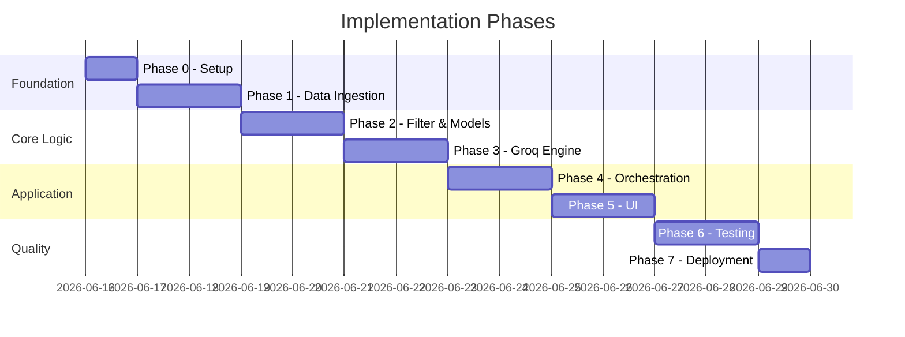
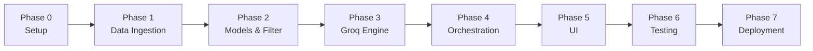

# Phase-Wise Implementation Plan

> Derived from [context.md](context.md) and [architecture.md](architecture.md)  
> Project: **AI-Powered Restaurant Recommendation System** (Zomato use case)

## Overview

This plan breaks the project into **7 phases**, ordered by dependency. Each phase has clear tasks, deliverables, and acceptance criteria aligned with the system workflow defined in [context.md](context.md) and the component design in [architecture.md](architecture.md).

### Implementation Timeline (Suggested)



### Phase Dependency Map



### Requirements Traceability

| Context requirement | Phase(s) |
|---------------------|----------|
| Load Zomato dataset from Hugging Face | Phase 1 |
| Preprocess restaurant fields | Phase 1 |
| Accept user preferences | Phase 2, 5 |
| Filter dataset by user input | Phase 2 |
| Build LLM prompt with filtered data | Phase 3 |
| Rank, explain, summarize (Groq) | Phase 3 |
| Display results (name, cuisine, rating, cost, explanation) | Phase 5 |

---

## Phase 0: Project Setup & Configuration

**Goal:** Establish the repository structure, dependencies, and environment so later phases can be built incrementally.

### Tasks

- [ ] Initialize Python project with virtual environment
- [ ] Create folder structure per [architecture.md §5](architecture.md#5-module-structure-suggested)
- [ ] Add `requirements.txt` with core dependencies:
  - `datasets` (Hugging Face)
  - `groq`
  - `pydantic` / `pydantic-settings`
  - `fastapi`, `uvicorn` (API)
  - `streamlit` (UI — recommended for milestone demo)
  - `python-dotenv`
  - `pytest` (testing)
- [ ] Create `config/settings.py` with env-backed settings:
  - `GROQ_API_KEY`
  - `GROQ_MODEL` (default: `llama-3.3-70b-versatile`)
  - `MAX_CANDIDATES` (default: 30)
  - `TOP_K` (default: 5)
  - `DATASET_NAME` (default: `ManikaSaini/zomato-restaurant-recommendation`)
- [ ] Add `.env.example` (no secrets committed)
- [ ] Add `.gitignore` (`.env`, `__pycache__`, `.venv`, etc.)
- [ ] Create empty module stubs (`app/services/`, `app/models/`, etc.)

### Deliverables

| File / Artifact | Purpose |
|-----------------|---------|
| `requirements.txt` | Dependency lock |
| `config/settings.py` | Central configuration |
| `.env.example` | Document required env vars |
| Project skeleton | All folders and `__init__.py` files |

### Acceptance Criteria

- [ ] `pip install -r requirements.txt` succeeds
- [ ] Settings load from environment without errors
- [ ] Project imports resolve (`python -c "from config.settings import settings"`)

### Estimated Effort

**0.5–1 day**

---

## Phase 1: Data Ingestion & Preprocessing

**Goal:** Load the Zomato dataset from Hugging Face, clean it, and cache it in a normalized internal format.

> Maps to [context.md § System Workflow → Data Ingestion](context.md#1-data-ingestion) and [architecture.md §3.3](architecture.md#33-data-ingestion-layer)

### Tasks

- [ ] Implement `app/services/ingestion.py`:
  - [ ] Load dataset via `datasets.load_dataset(DATASET_NAME)`
  - [ ] Inspect raw columns and map to internal schema
  - [ ] Build in-memory list/cache of `Restaurant` objects
- [ ] Implement `app/utils/parsing.py`:
  - [ ] Parse ratings (e.g. `"4.1/5"` → `4.1`)
  - [ ] Parse cost strings (e.g. `"300-500"` → midpoint INR)
  - [ ] Map cost to budget tier (`low` / `medium` / `high`)
  - [ ] Split and normalize cuisine strings
  - [ ] Normalize location/city names
- [ ] Define `Restaurant` model in `app/models/restaurant.py`:
  - `id`, `name`, `location`, `cuisines`, `rating`, `cost_for_two`, `budget_tier`, `raw`
- [ ] Add startup hook to load cache once (singleton or module-level cache)
- [ ] Log ingestion stats: total rows, valid rows, dropped rows

### Deliverables

| Module | Responsibility |
|--------|----------------|
| `app/services/ingestion.py` | HF load + cache |
| `app/utils/parsing.py` | Field normalization |
| `app/models/restaurant.py` | Data model |

### Acceptance Criteria

- [ ] Dataset loads successfully from Hugging Face (~51K rows)
- [ ] At least name, location, cuisine, cost, and rating are populated for majority of records
- [ ] Budget tier is assigned consistently
- [ ] Cache is reusable across requests without reloading
- [ ] Sample script prints 5 cleaned `Restaurant` records

### Estimated Effort

**1–2 days**

---

## Phase 2: Domain Models, Validation & Candidate Filter

**Goal:** Define user preference models, validate input, and filter the dataset deterministically before any Groq call.

> Maps to [context.md § User Input & Integration Layer (filter)](context.md#2-user-input) and [architecture.md §3.4–3.5.1](architecture.md#34-user-input-layer)

### Tasks

- [ ] Define `UserPreferences` in `app/models/restaurant.py`:
  - `location`, `budget`, `cuisine`, `min_rating`, `additional_preferences`
- [ ] Implement `app/utils/validators.py`:
  - [ ] Required field checks
  - [ ] Budget enum validation
  - [ ] Min rating range (`0.0`–`5.0`)
  - [ ] Location match against known cities in dataset (exact or fuzzy)
- [ ] Implement `app/services/filter.py`:
  - [ ] Filter by location (case-insensitive)
  - [ ] Filter by budget tier
  - [ ] Filter by cuisine (substring/token match)
  - [ ] Filter by `min_rating`
  - [ ] Cap results at `MAX_CANDIDATES`; pre-sort by rating if over cap
  - [ ] Return empty list with reason when no matches
- [ ] Write unit tests for parsing and filter logic

### Deliverables

| Module | Responsibility |
|--------|----------------|
| `app/models/restaurant.py` | `UserPreferences` model |
| `app/utils/validators.py` | Input validation |
| `app/services/filter.py` | Deterministic candidate selection |
| `tests/test_filter.py` | Filter unit tests |
| `tests/test_parsing.py` | Parsing unit tests |

### Acceptance Criteria

- [ ] Valid preferences return a non-empty candidate list for common queries (e.g. Bangalore + medium budget)
- [ ] Overly strict filters return empty list without calling Groq
- [ ] Candidate count never exceeds `MAX_CANDIDATES`
- [ ] All filter unit tests pass

### Estimated Effort

**1–2 days**

---

## Phase 3: Groq Recommendation Engine

**Goal:** Build the Integration Layer prompt, call Groq for ranking/explanation, and parse structured responses.

> Maps to [context.md § Integration Layer & Recommendation Engine](context.md#3-integration-layer) and [architecture.md §3.5.2–3.7](architecture.md#352-prompt-builder)

### Tasks

- [ ] Implement `app/prompts/recommendation.py`:
  - [ ] System prompt: recommend only from provided list; output valid JSON
  - [ ] User prompt: serialize preferences + compact candidate JSON
  - [ ] Define expected Groq output schema (`summary`, `recommendations[]`)
- [ ] Implement `app/services/llm_client.py`:
  - [ ] Initialize Groq client with `GROQ_API_KEY`
  - [ ] Call `chat.completions.create` with `GROQ_MODEL`
  - [ ] Set temperature (`0.2–0.5`), max tokens, timeout
  - [ ] Request JSON output (`response_format` + prompt instructions)
  - [ ] Retry once on transient failure
- [ ] Implement response parser in `app/services/recommender.py` (or dedicated parser module):
  - [ ] Parse JSON from Groq response
  - [ ] Validate `restaurant_id`, `rank`, `explanation`
  - [ ] Join IDs back to cached `Restaurant` records
  - [ ] Build `Recommendation` objects (name, cuisine, rating, estimated_cost, explanation)
- [ ] Implement fallback path:
  - [ ] On Groq failure or invalid JSON → top-N by rating with template explanations
- [ ] Manual test with real Groq API key and sample candidates

### Deliverables

| Module | Responsibility |
|--------|----------------|
| `app/prompts/recommendation.py` | Prompt templates |
| `app/services/llm_client.py` | Groq API client |
| `app/services/recommender.py` | Parse, merge, fallback |
| `app/models/restaurant.py` | `Recommendation` model |

### Acceptance Criteria

- [ ] Groq returns ranked top 5 from a provided candidate list
- [ ] Every recommendation includes an AI-generated explanation
- [ ] Optional summary is included when prompt requests it
- [ ] No invented restaurant IDs in output (all IDs exist in candidate set)
- [ ] Fallback activates when Groq is mocked to fail
- [ ] End-to-end script: preferences → filter → Groq → parsed recommendations

### Estimated Effort

**2 days**

---

## Phase 4: Application Orchestration & API

**Goal:** Wire all services into a single recommendation flow and expose it via a REST endpoint.

> Maps to [architecture.md §3.2 & §6](architecture.md#32-application-layer-orchestration)

### Tasks

- [ ] Implement full orchestration in `app/services/recommender.py`:
  1. Validate input
  2. Filter candidates
  3. Early return if no candidates
  4. Build prompt and call Groq
  5. Parse and merge response
  6. Return `RecommendationResponse`
- [ ] Define request/response schemas in `app/models/schemas.py`
- [ ] Implement `app/api/routes.py`:
  - [ ] `POST /recommend` per API contract
  - [ ] `400` for validation errors
  - [ ] `200` with empty list + message when no candidates
- [ ] Implement `app/main.py` (FastAPI entry point)
- [ ] Load dataset cache on app startup (`lifespan` or startup event)
- [ ] Add basic logging:
  - [ ] Candidate count before/after filter
  - [ ] Groq latency
  - [ ] Parse failures

### Deliverables

| Module | Responsibility |
|--------|----------------|
| `app/services/recommender.py` | End-to-end orchestration |
| `app/models/schemas.py` | API DTOs |
| `app/api/routes.py` | REST routes |
| `app/main.py` | FastAPI app |

### Acceptance Criteria

- [ ] `POST /recommend` accepts JSON body from [architecture.md §6](architecture.md#6-api-contract-recommended)
- [ ] Response includes `summary`, `recommendations[]`, and `meta`
- [ ] Each recommendation has: name, cuisine, rating, estimated cost, explanation
- [ ] Invalid input returns structured error response
- [ ] API docs available at `/docs` (FastAPI auto-generated)

### Estimated Effort

**1–2 days**

---

## Phase 5: Presentation Layer (UI)

**Goal:** Build a user-friendly interface to collect preferences and display AI-powered recommendations.

> Maps to [context.md § Output Display](context.md#5-output-display) and [architecture.md §3.1](architecture.md#31-presentation-layer-output-display)

### Tasks

- [ ] Choose UI approach (recommended: **Streamlit** for milestone speed)
- [ ] Build preference form:
  - [ ] Location (text or dropdown from known cities)
  - [ ] Budget (low / medium / high)
  - [ ] Cuisine (optional text)
  - [ ] Minimum rating (slider or number input)
  - [ ] Additional preferences (free text)
- [ ] Call `POST /recommend` or invoke recommender service directly
- [ ] Display results as cards/list:
  - [ ] Rank
  - [ ] Restaurant name
  - [ ] Cuisine
  - [ ] Rating
  - [ ] Estimated cost
  - [ ] AI explanation
- [ ] Show optional summary at top
- [ ] UX polish:
  - [ ] Loading spinner during Groq call
  - [ ] Empty-state message when no results
  - [ ] Error message on API/Groq failure
  - [ ] Suggestion to relax filters when candidate set is empty

### Deliverables

| File | Responsibility |
|------|----------------|
| `app/main.py` or `ui/streamlit_app.py` | Streamlit UI |
| UI screenshots (optional) | Demo documentation |

### Acceptance Criteria

- [ ] User can submit all preference fields from [context.md](context.md)
- [ ] Top recommendations render clearly with all 5 required output fields
- [ ] Loading and error states are handled gracefully
- [ ] Full demo flow works: form → recommendations in under 10 seconds

### Estimated Effort

**1–2 days**

---

## Phase 6: Testing, Hardening & Documentation

**Goal:** Validate correctness, improve reliability, and finalize project documentation.

> Maps to [architecture.md §9](architecture.md#9-testing-strategy) and [architecture.md §7](architecture.md#7-cross-cutting-concerns)

### Tasks

- [ ] **Unit tests**
  - [ ] `parsing.py` — rating/cost/cuisine normalization
  - [ ] `filter.py` — all filter rules and cap logic
  - [ ] `validators.py` — edge cases and invalid input
- [ ] **Integration tests**
  - [ ] Mock Groq client; verify orchestration flow
  - [ ] Test fallback when Groq returns malformed JSON
  - [ ] Test empty candidate path (no Groq call)
- [ ] **Prompt tuning**
  - [ ] Verify JSON consistency across 3–5 sample queries
  - [ ] Adjust prompt if model invents IDs or skips fields
- [ ] **Security**
  - [ ] Confirm `GROQ_API_KEY` is not in source code
  - [ ] Sanitize free-text `additional_preferences` before prompt injection
- [ ] **Performance check**
  - [ ] Filter completes in < 100 ms
  - [ ] End-to-end request < 10 s (with Groq)
- [ ] Update docs:
  - [ ] `README.md` — setup, env vars, run instructions
  - [ ] Mark checklist items complete in [context.md](context.md)

### Deliverables

| Artifact | Purpose |
|----------|---------|
| `tests/` suite | Automated coverage |
| `README.md` | Developer & demo guide |
| Updated `context.md` checklist | Requirement completion |

### Acceptance Criteria

- [ ] All unit and integration tests pass (`pytest`)
- [ ] No secrets in repository
- [ ] README allows a new developer to run the app locally
- [ ] All [context.md Key Requirements Checklist](context.md#key-requirements-checklist) items verified

### Estimated Effort

**1–2 days**

---

## Phase 7: Deployment (Optional Milestone Stretch)

**Goal:** Deploy the application for demo access with secure secret management.

> Maps to [architecture.md §8](architecture.md#8-deployment-architecture-optional)

### Tasks

- [ ] Choose hosting (Render, Railway, or Hugging Face Spaces)
- [ ] Configure environment variables on host (`GROQ_API_KEY`, `GROQ_MODEL`)
- [ ] Add `Dockerfile` or platform-specific config (optional)
- [ ] Pre-load or cache dataset on container startup
- [ ] Smoke test deployed `/recommend` endpoint
- [ ] Document public demo URL in README

### Deliverables

| Artifact | Purpose |
|----------|---------|
| Deployment config | Platform setup |
| Live demo URL | Milestone submission |

### Acceptance Criteria

- [ ] App is accessible via public URL
- [ ] Recommendations work end-to-end in deployed environment
- [ ] API key remains in environment variables only

### Estimated Effort

**0.5–1 day**

---

## Master Checklist

Use this to track overall project completion:

| # | Milestone | Phase | Status |
|---|-----------|-------|--------|
| 1 | Project scaffold and config | 0 | ⬜ |
| 2 | Dataset loaded and preprocessed | 1 | ⬜ |
| 3 | User preferences validated | 2 | ⬜ |
| 4 | Candidate filter working | 2 | ⬜ |
| 5 | Groq prompt + client integrated | 3 | ⬜ |
| 6 | Response parsed and merged | 3 | ⬜ |
| 7 | Fallback path implemented | 3 | ⬜ |
| 8 | REST API exposed | 4 | ⬜ |
| 9 | UI displays full recommendation output | 5 | ⬜ |
| 10 | Tests passing | 6 | ⬜ |
| 11 | README and docs complete | 6 | ⬜ |
| 12 | Deployed demo (optional) | 7 | ⬜ |

---

## Suggested Execution Order (Quick Reference)

```
Phase 0  →  Setup repo, deps, env config
Phase 1  →  Load HF dataset → clean → cache Restaurant objects
Phase 2  →  UserPreferences + validators + filter service
Phase 3  →  Prompt builder + Groq client + parser/merger + fallback
Phase 4  →  Recommender orchestration + FastAPI POST /recommend
Phase 5  →  Streamlit UI (form + result cards)
Phase 6  →  Tests, prompt tuning, README, checklist sign-off
Phase 7  →  Deploy (optional)
```

---

## Risk Register

| Risk | Impact | Mitigation | Phase |
|------|--------|------------|-------|
| Dataset columns differ from expected | High | Inspect raw schema in Phase 1 before mapping | 1 |
| Groq returns invalid JSON | Medium | Strict prompt + parser validation + fallback | 3 |
| Groq API key missing/invalid | Medium | Clear startup error; document in `.env.example` | 0, 3 |
| Too many candidates → token overflow | Medium | Enforce `MAX_CANDIDATES` cap in filter | 2 |
| LLM hallucinates restaurant IDs | High | Pass IDs in prompt; validate against candidate set | 3 |
| Slow first startup (574 MB dataset) | Low | Load once at startup; log progress | 1, 4 |
| Empty filter results frustrate users | Low | Empty-state UX with filter relaxation hints | 4, 5 |

---

## Summary

This plan implements the five workflow stages from [context.md](context.md) across seven build phases defined by [architecture.md](architecture.md). **Phases 0–3** build the data and intelligence pipeline (ingest → filter → Groq). **Phases 4–5** expose and present results. **Phases 6–7** ensure quality and optional deployment.

**Minimum viable milestone:** Complete Phases 0–6 (working local app with Groq recommendations and UI).  
**Full milestone:** Complete Phase 7 with a deployed demo.
